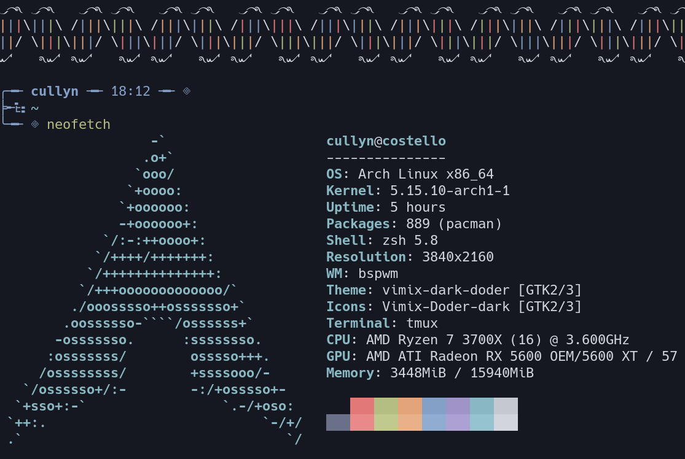

<h1 align="center">⚙️ dotfiles ⚙️</h1>

<kbd>
  
</kbd>

 

## Information

- OS: [Arch Linux](https://wiki.archlinux.org/title/Arch_Linux)
- Window manager: [bspwm](https://github.com/baskerville/bspwm),
  - keyboard and pointer events: [sxhkd](https://github.com/baskerville/sxhkd)
- Shell: [zsh](https://en.wikipedia.org/wiki/Z_shell),
  - [syntax highlighting](https://github.com/zsh-users/zsh-syntax-highlighting)
  - [auto suggestions](https://github.com/zsh-users/zsh-autosuggestions)
  - [auto complete](https://github.com/marlonrichert/zsh-autocomplete)
  - [colored man pages](https://github.com/ael-code/zsh-colored-man-pages)
- Terminal: [alacritty](https://github.com/alacritty/alacritty),
  - with terminal multiplexer [tmux](https://en.wikipedia.org/wiki/Tmux)
- Prompt: custom [starship](https://starship.rs/),
  - with a hard coded [custom DNA greeter](config/zsh/greeting.sh)
- Editor: [neovim](https://github.com/neovim/neovim),
  - plugins used [init.vim](config/nvim/init.vim)
  - [config files](config/nvim/plugin)
- Color scheme: [iceberg](https://github.com/cocopon/iceberg.vim) (slightly extended)
- Wallpaper: [moon jelly](resources/wallpapers/jelly-3840x2160.jpg)
- Browser: keyboard focused firefox with custom css,
  - initially forked from [eduardhojbota's moonlight userChrome](https://github.com/eduardhojbota/moonlight-userChrome) theme.
- File manager: [nnn](https://github.com/jarun/nnn)
- Status bar: [polybar](https://github.com/polybar/polybar)
- Launcher: [rofi](https://github.com/davatorium/rofi)
  - theme initially sourced from one of [adi1090x's rofi themes](https://github.com/adi1090x/rofi)
- PDF viewer: [zathura](https://pwmt.org/projects/zathura/)
- Notifications: [dunst](https://github.com/dunst-project/dunst)
- Music: [ytmdesktop](https://github.com/ytmdesktop/ytmdesktop),
  - music visualizer [cava](https://github.com/karlstav/cava)
- Fonts: [google fonts](https://aur.archlinux.org/packages/ttf-google-fonts-git/) / [nerd fonts](https://github.com/ryanoasis/nerd-fonts)
  - Open Sans (serif)
  - Roboto Slab (serif)
  - Hack Nerd Font (monospace)
  - Noto Color Emoji and Noto Emoji
- GTK: [vimix](https://github.com/vinceliuice/vimix-gtk-themes)
  - cursor: [vimix curosor](https://github.com/vinceliuice/Vimix-cursors)
  - icons: [vimix icons](https://github.com/vinceliuice/vimix-icon-theme)
